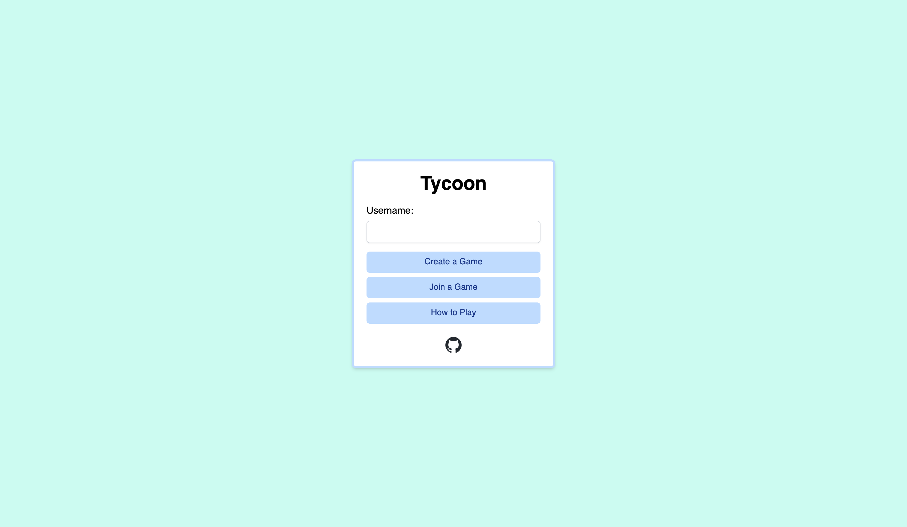
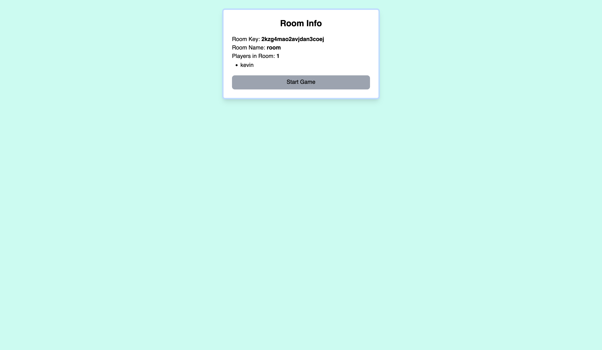
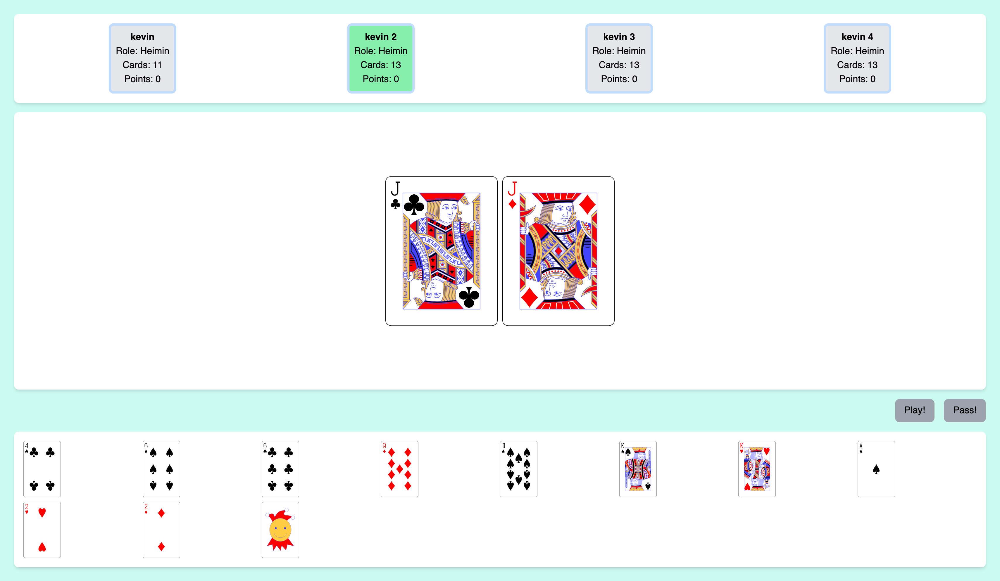

# Tycoon

An online multiplayer representation of the card game Tycoon, or Daifugō using the Persona 5 Royal Ruleset.

Deployed at https://tycoon-flax.vercel.app/.

# Screenshots

# Local Build

You can use the provided Makefile to install and start both the client and server locally, with `make install` and then `make start`. Must change CORS settings in [`server/index.ts`](https://github.com/kliu04/Tycoon/blob/master/server/index.ts) to `http://localhost:3000`.
